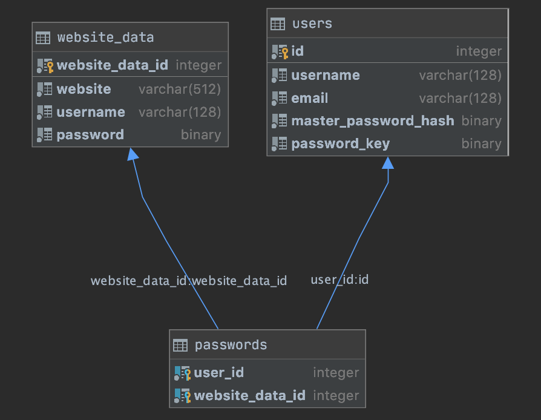

# Password Manager

This project is a simple password manager with secure storage in an SQLite database with password encryption.
User login is secured using Spring Security Crypto and saved passwords are encrypted using the Java Cipher library.

## Table of contents

[Demo](#demo) 
[Features](#features) 
[Database Design](#database-design) 
[Security Design](#security-design) 
[Development Timeline](#development-timeline) 
[Problems I Faced](#problems-i-faced) 
[Potential Improvements](#potential-improvements) 
[Installation and Usage](#installation-and-usage)

## Demo

## Features

- Register/login user
- Save a password
- Retrieve a saved password
- Delete a saved password
- Change a saved username
- Change a saved password
- Delete a user
- Print all saved websites and usernames

## Database Design

## Security Design

### User login

User information is stored in the "users" table as shown above. 
There, the user's hashed master password is stored (master_password_hash). 
This hash is obtained using a SHA-256 password encoder from Spring Security. 
This allows for secure user login into the password manager.

### Saved passwords

A user's saved passwords are saved using the Java Cipher class. 
This allows for encryption and decryption of the saved passwords using a cipher key. 
This key is obtained by taking a random alphanumeric string with a length of eighteen and encrypting it through AES using the user's password as the secret key. 
This random string is created on user registration and stored in the database (password_key) after being encrypted by the password. 
Upon user login, this string is decrypted and is used as the key for the encrypted passwords. 
Thus, whenever a password is added, it is encrypted through AES using the key before being inserted into the database. 
This allows for secure password storage where neither the passwords nor the decryption key is stored as plain text in the database.

## Development Timeline

Note: not all development is shown in my Git history as I made some improvements as a completely new project

1. No user login, passwords stored in YAML (one user only)
2. Beginning database design, still no user login (one user only)
3. User registration and log in, database storage, secure encryption and password hashing (multiple users)

## Problems I Faced

- Database design: my initial database design made for complicated SQL queries
- Finding a secure encryption library: I ended up using two, one for user login and a different one for password storage

## Potential Improvements

- More efficient SQL statements, especially for the following
    - User deletion
    - Password deletion
    - Password updating
- Implement a user interface
- Performance analysis --> potential performance improvements
- Unit testing

## Installation and Usage

1. Clone the repository
3. Run `mvn package`
4. Run `java -jar target/passwords-1.0-SNAPSHOT.jar`